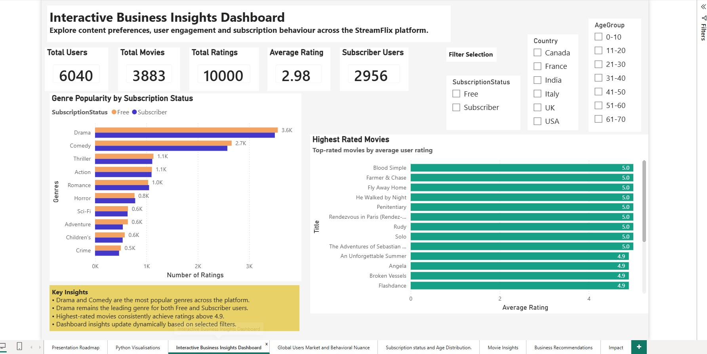
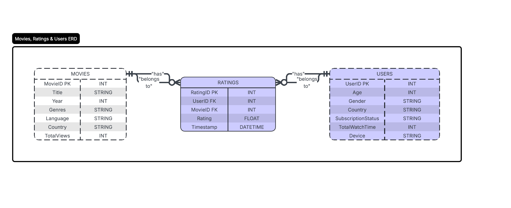

# 🎬 Movies Database Analytics Project

## Dashboard Preview



## Project Overview

This project was completed as part of the Generation Australia Data Analytics Bootcamp.

The objective was to analyze a movie streaming platform dataset by performing data cleaning, database design, SQL analysis, Python visualizations, and Power BI dashboard development to generate business insights that support content strategy and subscription growth decisions.

The project follows an end-to-end analytics workflow covering data preparation, database implementation, exploratory analysis, visualization, and business reporting.

---

## Team Project Acknowledgement

This project was completed as a collaborative team project during the Data Analytics Bootcamp.

Team members contributed across multiple areas including:

- Data cleaning and validation
- Database design and implementation
- Entity Relationship Diagram (ERD) creation
- SQL analysis
- Python visualizations
- Power BI dashboard development
- Documentation and sprint deliverables

This repository has been created separately to organize and showcase my learning outcomes, project artefacts, and contributions for portfolio purposes.

---
## My Contributions

Throughout this project, I contributed to the following activities:

- Performed data cleaning and validation on the Movies dataset.
- Conducted data quality assessments for the Users and Ratings datasets.
- Reviewed database schema design and relationships.
- Developed SQL queries for data validation and business analysis.
- Contributed to Python-based data visualizations and interpretation of insights.
- Prepared project documentation, reports, and sprint deliverables.
- Coordinated sprint planning, task tracking, progress updates, and team communication as Scrum Master.
- Managed and organized project artefacts for portfolio presentation.
- Contributed to business insights and recommendations based on analysis findings.

---
## Business Scenario

A streaming platform wanted to better understand:

- User viewing behaviour
- Content preferences
- Genre popularity
- Subscription trends
- Demographic patterns
- Device usage trends

The goal was to provide actionable insights that could help improve content acquisition strategies and increase subscriber engagement.

---
## Business Questions Addressed

- Which movies receive the highest ratings?
- Which genres are most popular among subscribers?
- How do viewing patterns differ between Free and Subscriber users?
- Which countries contribute the largest user base?
- Which devices are most commonly used for streaming?
- Which audience segments offer the greatest growth opportunities?

---
## Technologies Used

| Technology | Purpose |
|------------|----------|
| Excel | Data cleaning and validation |
| SQL Server | Database creation and analysis |
| SQL | Data querying and business analysis |
| Python | Data visualization |
| Power BI | Dashboard development |
| GitHub | Version control and project documentation |

---
## Skills Demonstrated

- Data Cleaning & Validation
- Data Quality Assessment
- SQL Query Development
- Relational Database Design
- Data Visualization
- Dashboard Development
- Business Analysis
- Data Storytelling
- Agile Team Collaboration
- GitHub Version Control

---

## Project Workflow

### 1. Data Cleaning & Validation

Performed data quality assessment and cleansing on:

- Movies Dataset
- Users Dataset
- Ratings Dataset

Activities included:

- Handling missing values
- Correcting data inconsistencies
- Standardizing formats
- Data validation checks
- Data quality documentation

---

### 2. Database Design

Designed a relational database structure containing:

#### Movies Table
- MovieID
- Title
- Genre
- Language
- Country
- Year
- Total Views

#### Users Table
- UserID
- Age
- Gender
- Country
- Subscription Status
- Device Type

#### Ratings Table
- RatingID
- UserID
- MovieID
- Rating
- Timestamp

Primary and Foreign Key relationships were implemented and validated.

### Entity Relationship Diagram



---

### 3. SQL Analysis

SQL queries were developed to generate business insights including:

- Top rated movies
- Genre popularity analysis
- Subscriber vs free user behaviour
- User demographic analysis
- Country-based user distribution
- Device usage trends

---

### 4. Python Visualizations

The following visualizations were developed using Python:

1. Top Rated Movies by Subscription Status
2. Most Popular Genres by Subscription Status
3. User Distribution by Age Group
4. Distribution of Users by Subscription Status
5. User Distribution by Country
6. Device Usage Distribution by Subscription Status

---

### 5. Power BI Dashboard

An interactive dashboard was created to present:

- User demographics
- Content consumption trends
- Subscription analysis
- Device usage patterns
- Genre popularity insights
- Business recommendations

---
## Project Outcome


The project successfully transformed raw movie streaming data into actionable business insights through data cleaning, database design, SQL analysis, Python visualizations, and interactive dashboard reporting.

The analysis highlighted trends in content popularity, subscriber behaviour, audience demographics, and device usage, helping identify opportunities to improve content strategy, audience engagement, and subscription growth.

---
## Repository Structure

```text
Movies-Database-Analytics-Project
│
├── Data
│   ├── Raw
│   └── Processed
│
├── Documents
│   ├── Sprint1
│   ├── Sprint2
│   ├── Database_Design
│   └── Reports
│
├── Images
├── PowerBI
├── Python
└── SQL
```

### Data

Contains:

- Original datasets
- Cleaned datasets

### Documents

Project documentation including:

- Data Cleaning & Validation Report
- Data Quality Assessment
- Database Design Documentation
- ERD Documentation
- Sprint Deliverables
- SQL Analysis Reports
- Visualization Reports

### Images

Contains generated visualizations and dashboard screenshots.

### PowerBI

Contains:

- Power BI Dashboard (.pbix)

### Python

Contains:

- Visualization scripts
- Dashboard generation scripts

### SQL

Contains:

- SQL queries used for analysis and reporting

---

## Key Deliverables

✔ Data Cleaning and Validation

✔ Data Quality Assessment

✔ Relational Database Design

✔ Entity Relationship Diagram (ERD)

✔ SQL Analysis

✔ Python Visualizations

✔ Power BI Dashboard

✔ Business Insights and Recommendations

---

## Key Insights Generated

Some of the business questions explored include:

- Which movies receive the highest ratings?
- Which genres are most popular among subscribers?
- How does user behaviour differ between subscription types?
- Which countries contribute the largest user base?
- Which devices are most commonly used for streaming?
- Which audience segments should be targeted for future growth?

---

## Files Included

### Datasets
- Movies.csv
- Users.csv
- Ratings_Dataset.csv
- Cleaned datasets

### Documentation
- Data Cleaning and Validation Report
- Data Quality Assessment Report
- Database Schema Design Documentation
- Sprint Deliverables
- SQL Analysis Reports
- Visualization Reports

### Visualizations
- Top Rated Movies
- Genre Popularity
- User Demographics
- Subscription Analysis
- Device Usage Analysis

### Dashboard
- Final_Team1_StreamFlix_analysis.pbix

---

## Learning Outcomes

This project strengthened practical skills in:

- Data Cleaning
- Data Quality Assessment
- Relational Database Design
- SQL Query Development
- Data Visualization
- Power BI Dashboard Development
- Business Insight Generation
- Team Collaboration
- Agile Sprint-Based Project Delivery

---

## Disclaimer

This repository is intended for educational and portfolio purposes only.

The project was completed during the Generation Australia Data Analytics Bootcamp as part of a collaborative team assignment. All datasets and deliverables are used solely for demonstrating data analytics skills and learning outcomes.
